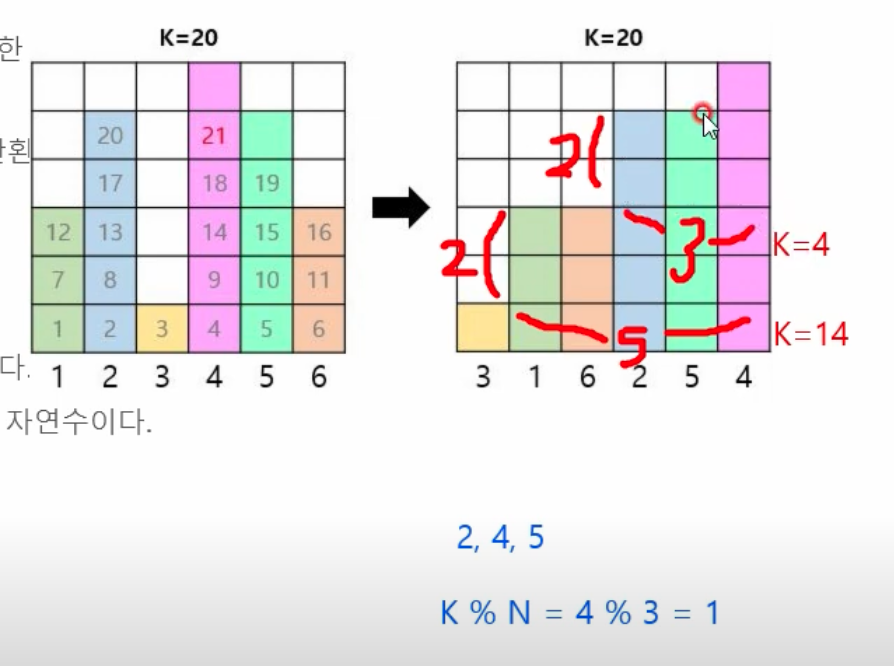

# 1. 그리디

# Part 2

# #1. 큰 수의 법칙

## 내가 짠 코드

**💡 Idea**

m=8, k=3, [2,4,5,4,6] 에서

6 6 6 5 6 6 6 5

가장 큰 수 등장 횟수 : (m // k) \* k

두 번째로 큰 수 등장 횟수 : m % k

**💻 Code**

```python
# 큰 수의 법칙
import sys

sys.stdin = open("in.txt", "rt")
read = sys.stdin.readline

n, m, k = map(int, read().split())  # 배열크기, 숫자더하는횟수, 같은 수 연속횟수제한
nums = list(map(int, read().split()))
nums.sort(reverse=True)

res = nums[0] * k * (m // k) + nums[1] * (m % k)
print(res)

```

---

# #2. 숫자 카드 게임

## 내가 짠 코드

**💡 Idea**

각 행(row)에서 최솟값 들 중에서 최댓값을 뽑아햠

**💻 Code**

```python
# 숫자 카드 게임
import sys

sys.stdin = open("in2.txt", "rt")
read = sys.stdin.readline

n, m = map(int, read().split())
board = [list(map(int, read().split())) for _ in range(n)]
maxx = int(-1e9)
for row in board:
    maxx = max(maxx, min(row))

print(maxx)
```

---

# #3. 1이 될 때까지

## 내가 짠 코드

**💡 Idea**

1. N이 K로 나눠지면 ⇒ K로 나눔
2. N이 K로 안 나눠지면 ⇒ K에서 1을 뺌
3. 1→2 반복

**💻 Code**

```python
# 1이 될 때까지
import sys
import time

start_time = time.time()
sys.stdin = open("in.txt", "rt")
read = sys.stdin.readline

n, k = map(int, read().split())
cnt = 0
while n != 1:
    if n % k == 0:
        n //= k
    else:
        n -= 1
    cnt += 1
print(cnt)

# 로직 끝
print(f"실행시간 : {time.time() - start_time}\n")
```

---

# Part 3

# #1. 모험가 길드

## 내가 짠 코드

**💡 Idea**

일단 공포도가 낮은 사람부터 그룹핑을 해야한다. 그래야 그룹이 최대한 많이 생긴다.

따라서 오름차순 정렬을 한다.

투 포인터 i,j 를 사용한다. ( i: 그룹시작, j: 그룹끝 )

i 가 가리키는 수를 개수로 하여 그룹핑을 했을 때 그룹이 완성되면 다음 그룹으로 넘어가고,

그룹 조건에 맞지 않으면 끝 포인터인 j 만을 증가시켜서 다시 그룹 성립을 확인한다.

**💻 Code**

```python
import sys

sys.stdin = open("in.txt", "rt")
read = sys.stdin.readline

n = int(read())
nums = list(map(int, read().split()))

nums.sort()
cnt = 0
i, j = 0, 0  # 투포인터 ( i: 시작포인터, j : 끝포인터)
flag = 0
length = len(nums)

# i,j 투 포인터 => 둘 다 length 보다 작을동안만 while loop 반복
while j < length and i < length:

    # 이전 루프에서 flag 가 0 일때만 j 포인터 다시 설정
    if i + (nums[i] - 1) < length and flag == 0:
        j = i + (nums[i] - 1)

    if nums[j] == j - i + 1:
        flag = 0  # flag 가 0 : 현재 loop에서 그룹완성한 상태. i,j 다시 세팅
        cnt += 1  # 그룹개수 증가
        i = j + 1  # i 값 새롭게 세팅
    else:
        flag = 1  # flag 1 : 그룹 완성 못해서 i 값 유지, j 값만 1 증가
        j += 1

print(cnt)
```

**✍ Solution**

`j = i + (nums[i] - 1)` : 끝 포인터(j) 위치 초기세팅

`if nums[j] == j - i + 1:` : nums[j] == 그룹의 사람 수(`j-i+1`) 이면 그룹 ok

**💬 Commentary**

너무 어렵게 푼듯함.

## 강의 코드 및 강의 내용

**💡 Idea**

`현재 그룹의 인원 수(count) == 모험가의 공포도` : 그룹 완성

[1, 1, 2, 3, 3] 에서

1번째 루프: 그룹에 i = 1 이 들어오고, 인원 수(count) 를 1 증가시킨다. count == i 이므로 그룹 완성

2번째 루프: 그룹에 i = 1 이 들어오고, 인원 수(count) 를 1 증가시킨다. count == i 이므로 그룹 완성

3번째 루프: 그룹에 i = 2 가 들어오고, 인원 수(count) 를 1 증가시킨다. count(1) < i (2)이므로 아직 그룹 미완성

4번째 루프: 그룹에 i = 3 이 들어오고, 인원 수(count) 를 1 증가시킨다. count(2) < i (3) 이므로 아직 그룹 미완성

5번째 루프: 그룹에 i = 3 이 들어오고, 인원 수(count) 를 1 증가시킨다. count(3) == i (3) 이므로 그룹 완성

그룹 : (1) (1) (2,3,3) ⇒ 3개

**💻 Code**

```python
import sys

sys.stdin = open("in.txt", "rt")

n = int(input())
data = list(map(int, input().split()))
data.sort()

result = 0  # 총 그룹의 수
count = 0  # 현재 그룹에 포함된 모험가의 수

for i in data:  # 공포도를 낮은 것부터 하나씩 확인하며
    count += 1  # 현재 그룹에 해당 모험가를 포함시키기
    if count == i:  # 현재 그룹에 포함된 모험가의 수 == 현재의 공포도 라면, 그룹 결성
        result += 1  # 총 그룹의 수 증가시키기
        count = 0  # 현재 그룹에 포함된 모험가의 수 초기화

print(result)  # 총 그룹의 수 출력
```

**💬 Commentary**

그룹 완성을 결정짓는 변수는 `현재 그룹의 모험가 수` 와 `현재 모험가의 공포도` 이므로 전체 데이터를 순회하면서 비교하면 되는 문제였다.

---

# #2. 곱하기 혹은 더하기

## 내가 짠 코드

**💡 Idea**

| 현재 수(res)    | 다음 수(nums[i+1]) | 해야하는 연산 |
| --------------- | ------------------ | ------------- |
| 0               | ?                  | +             |
| 1               | ?                  | +             |
| ?               | 0                  | +             |
| ?               | 1                  | +             |
| 0,1 제외 나머지 | 0,1 제외 나머지    | \*            |

**💻 Code**

```python
import sys

sys.stdin = open("in.txt", "rt")
read = sys.stdin.readline

nums = list(map(int, read().rstrip()))
res = nums[0]
for i in range(len(nums) - 1):
    # 현재 수(res) 가 0 또는 1 이거나, 다음 수(nums[i+1])가 0 또는 1 이면 더해야함.
    if res == 0 or res == 1 or nums[i + 1] == 0 or nums[i + 1] == 1:
        res += nums[i + 1]
    # 나머지 경우는 곱셈
    else:
        res *= nums[i + 1]

print(res)
```

**💬 Commentary**

`res` 가 `현재까지 계산한 수` 라는 점 중요했음

## 강의 코드 및 강의 내용

**💡 Idea**

로직 동일

**💻 Code**

```python
data = input()

# 첫 번째 문자를 숫자로 변경하여 대입
result = int(data[0])

for i in range(1, len(data)):
    # 두 수 중에서 하나라도 '0' 혹은 '1'인 경우, 곱하기보다는 더하기 수행
    num = int(data[i])
    if num <= 1 or result <= 1:
        result += num
    else:
        result *= num

print(result)
```

**💬 Commentary**

내 코드에서 `if res == 0 or res == 1 or nums[i + 1] == 0 or nums[i + 1] == 1:` 를

`if num <= 1 or result <= 1:` 로 더 간결히 할 수 있었음

---

# #3. 문자열 뒤집기 (boj 1439)

## 내가 짠 코드

**💡 Idea**

0 그룹 과 1 그룹의 개수를 세서 둘 중에 작은 값이 정답이다.

0 → 1 전환 : 1 그룹 개수 증가

1 → 0 전환 : 0 그룹 개수 증가

**💻 Code**

```python
import sys

read = sys.stdin.readline

s = list(map(int, read().rstrip()))
cnt_zero, cnt_one = 0, 0  # 0,1 그룹 개수
before = s[0]  # before 초기값 : 첫 숫자
if before == 0:
    cnt_zero += 1
elif before == 1:
    cnt_one += 1

for num in s[1:]:  # 인덱스 1부터 시작
    if (before, num) == (0, 1):
        cnt_one += 1
    elif (before, num) == (1, 0):
        cnt_zero += 1
    before = num  # before 에 num 저장
print(min(cnt_zero, cnt_one))
```

---

# #4. 만들 수 없는 금액 ⇒ 복습

## 내가 짠 코드

**💡 Idea**

그리디 로 푸는 방법이 도저히 안 떠올라서 그냥 dfs 완전탐색으로 풀었다

하지만 이 풀이는 시간복잡도가 $O(2^n)$ 이라서 사실상 틀린 풀이다. ( 1 ≤ n ≤ 1000 )

**💻 Code**

```python
import sys

sys.stdin = open("in.txt", "rt")
read = sys.stdin.readline

n = int(read())
coins = list(map(int, read().split()))
res = []

# 완전탐색
def dfs(L, cur):
    if L == n:
        res.append(cur)
        return
    else:
        dfs(L + 1, cur + coins[L])
        dfs(L + 1, cur)

dfs(0, 0)
U = set(range(1, sum(coins)+1))  # 모든 경우 전체집합
res = set(res)  # 만들 수 있는 경우 집합
print(min(U - res))
```

## 강의 코드 및 강의 내용

**💡 Idea**

[1, 1, 2, 3, 9] 의 동전이 있다고 하자. (오름차순 정렬을 마친 상태)

`target` 은 만들 수 있는지 검증하고자 하는 금액이다.

1. 맨 처음 target 의 초기값은 1 로 설정한다.
2. 동전을 하나씩 꺼내면서 반복문을 수행한다.

   | 현재 동전(coin) | 현재 만들 수 있는 금액                                              | 다음 루프에서 검증할 금액(target) |
   | --------------- | ------------------------------------------------------------------- | --------------------------------- |
   | X               | X                                                                   | 1 (초기값)                        |
   | 1               | 1                                                                   | 2 (1+1) ← target_before + coin    |
   | 1               | 1, 2(1+1)                                                           | 3 (2+1)                           |
   | 2               | 1, 2, 3(1+2), 4(2+2)                                                | 5 (3+2)                           |
   | 3               | 1, 2, 3, 4, 5(2+3), 6(3+3), 7(4+3)                                  | 8 (5+3)                           |
   | 9               | 1, 2, 3, 4, 5, 6, 7, 8(X), 9, 10(1+9), 11(2+9), 12(3+9) ... 16(7+9) |                                   |

   target (**8**) < coin (**9**) 가 돼서 **8**원짜리가 생성이 안 되는 것을 볼 수 있다.

새로운 coin 이 들어올 때,

- 이전 루프의 금액 그대로 (새로운 coin 안 더함)
- 이전 루프의 금액 + 새로운 coin

의 두 가지 방법에서 나오는 금액으로 현재 만들 수 있는 금액이 만들어진다.

이전 루프의 값을 계속해서 이용하기 때문에 약간 dp 문제 느낌도 난다.

**💻 Code**

```python
import sys

sys.stdin = open("in.txt", "rt")
read = sys.stdin.readline

n = int(read())
coins = list(map(int, read().split()))
coins.sort()

target = 1  # 검증하고자 하는 금액
for coin in coins:
    # target 금액을 만들 수 있는지 검증
    if target < coin:  # 이럴 경우 target 금액을 못 만듦
        break
    # target 값 갱신
    target += coin  # 다음 루프의 target
print(target)
```

**✍ Solution**

**💬 Commentary**

발상이 어려웠지만 얻어갈 것 많았던 문제

다시 봐도 어렵다.

---

# #5. 볼링공 고르기

## 내가 짠 코드

**💡 Idea**

오름차순 정렬 후 i, j 인덱스 이중 for문으로 `weigths[i] < weights[j]` 인 경우에만 개수 추가해주기

⇒ $O(n^2)$ 이여서 비효율적인 풀이

ex.

weights : [1, 2, 2, 3, 3]

- i = 0 : j = 1, 2, 3, 4 ⇒ 4가지
- i = 1 : j = 3, 4 ⇒ 2가지
- i = 2 : j = 3, 4 ⇒ 2가지
- i = 3 : 0가지

⇒ 총 경우의 수 8가지

**💻 Code**

```python
import sys

sys.stdin = open("in.txt", "rt")
read = sys.stdin.readline

n, m = map(int, read().split())
weights = list(map(int, read().split()))
weights.sort()
cnt = 0
for i in range(len(weights)-1):
    for j in range(i + 1, len(weights)):
        if weights[i] < weights[j]:
            cnt += 1

print(cnt)
```

## 강의 코드 및 강의 내용

**💡 Idea**

인덱스 관점이 아니라 무게 관점에서 접근하면 한 번 순회( $O(n)$ ) 만에 가능하다.

`weights : [1, 2, 2, 3, 3]` (굳이 정렬은 안해도 됨)

각 무게 별로 볼링공이 몇 개 존재하는 지 저장하는 별도의 리스트가 필요하다. (문제에서 1≤무게≤10)

무게 1 : 1개

무게 2 : 2개

무게 3 : 2개

⇒ `balls: [0, 1, 2, 2, 0, 0, ...]`

balls 리스트를 순회하면서 A가 해당 무게를 골랐을 때, B는 해당 무게를 제외한 볼링공을 고를 수 있다.

- A가 무게 1 짜리 공을 골랐을 때 : 무게 1 경우의 수 (1) \* B가 고를 수 있는 경우의 수 (4) = 4
- A가 무게 2 짜리 공을 골랐을 때 : 무게 2 경우의 수 (2) \* B가 고를 수 있는 경우의 수 (2) = 4

**💻 Code**

```python
import sys

sys.stdin = open("in.txt", "rt")
read = sys.stdin.readline

n, m = map(int, read().split())
weights = list(map(int, read().split()))
balls = [0] * (m + 1)

# 무게 당 볼링공 개수 저장
for w in weights:
    balls[w] += 1

res = 0
for i in range(1, m + 1):  # balls 리스트 순회
    n -= balls[i]  # 전체 볼링공 개수에서 현재 무게 볼링공 개수 빼기
    res += balls[i] * n  # (현재 무게의 볼링공 개수) * (B가 가능한 경우의 수)

print(res)
```

**💬 Commentary**

무게 당 볼링공 개수를 저장하는 리스트를 통해서 O(n) 만에 구현하는 아이디어 알아두기

---

# #6. 무지의 먹방 라이브

## 내가 짠 코드

정확성테스트 모두 통과

효율성테스트 모두 시간초과

**💡 Idea**

food_times 리스트를 계속 순회하면서, 값이 0보다 클 때만 값에서 1을 빼주고 시간을 증가시킨다.

주어진 시간이 되면 break 를 한다.

**💻 Code**

```python
def solution(food_times, k):
    answer = 0
    length = len(food_times)
    sec = 0
    flag = 0

    while True:
        for i in range(length):
            if max(food_times) == 0:  # 먹방을 할 수 없는 경우에는 while문 break
                answer = -1
                flag = 1
                break
            elif food_times[i] > 0:  # 먹방 가능한 경우
                if sec == k:  # 탈출
                    answer = i + 1
                    flag = 1
                    break
                else:  # 먹방하고 시간증가
                    food_times[i] -= 1
                    sec += 1
        if flag == 1:
            break

    return answer

# 정확성 테스트는 다 통과지만
# 효율성 테스트에서 다 시간초과
```

**✍ Solution**

**💬 Commentary**

떠올릴 수 있는 가장 간단한 풀이지만 역시나 시간초과가 떴다.

## 강의 코드 및 강의 내용

**💡 Idea**



**💻 Code**

```python
def solution(food_times, k):

    foods = []
    n = len(food_times)
    for i in range(n):
        foods.append((food_times[i], i+1))
    foods.sort()

    pre_time = 0 # 직전 음식을 다 먹는데 필요한 시간
    for i, food in enumerate(foods):
        diff = food[0] - pre_time # 시간차이 = 현재음식 필요시간 - 직전음식 필요시간
        spend_time = diff * n
        if spend_time <= k:
            k -= spend_time
            pre_time = food[0]
        else:
            k %= n
            temp = sorted(foods[i:], key = lambda x:x[1])
            return temp[k][1]
        n -= 1 # 음식 개수 하나 감소

    return -1 # for문 안에서 return 안 걸리고 나오면 시간이 남은 것이므로 -1
```

**✍ Solution**

**💬 Commentary**

풀이 참고 : [https://www.youtube.com/watch?v=zpz8SMzwiHM](https://www.youtube.com/watch?v=zpz8SMzwiHM)

---
