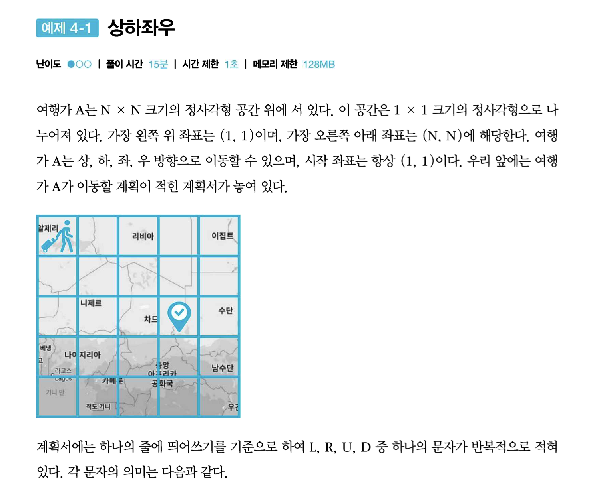

# 2. 구현

Category: Algorithm
Created: 2022년 3월 30일 오후 10:20
Creator: HyeonSoo Choi
Updated: 2022년 3월 31일 오전 2:16

# Part 2

# #예제1. 상하좌우




## 내가 짠 코드

**💡 Idea**

**💻 Code**

```python
# 상하좌우
import sys

sys.stdin = open("in.txt", "rt")
read = sys.stdin.readline

n = int(read())
commands = read().split()
x, y = 1, 1

for cmd in commands:
    if cmd == "R":
        dx, dy = 0, 1
    elif cmd == "D":
        dx, dy = 1, 0
    elif cmd == "L":
        dx, dy = 0, -1
    elif cmd == "U":
        dx, dy = -1, 0

    if 1 <= x + dx <= n and 1 <= y + dy <= n:
        x += dx
        y += dy

print(x, y)
```

**✍ Solution**

**💬 Commentary**

## 강의 코드 및 강의 내용

**💡 Idea**

**💻 Code**

```python
import sys

sys.stdin = open("in.txt", "rt")
# N 입력받기
n = int(input())
x, y = 1, 1
plans = input().split()

# L, R, U, D에 따른 이동 방향
dx = [0, 0, -1, 1]
dy = [-1, 1, 0, 0]
move_types = ["L", "R", "U", "D"]

# 이동 계획을 하나씩 확인
for plan in plans:
    # 이동 후 좌표 구하기
    for i in range(len(move_types)):
        if plan == move_types[i]:
            nx = x + dx[i]
            ny = y + dy[i]
    # 공간을 벗어나는 경우 무시
    if nx < 1 or ny < 1 or nx > n or ny > n:
        continue
    # 이동 수행
    x, y = nx, ny

print(x, y)
```

**✍ Solution**

**💬 Commentary**

dx, dy, move_types 배열로 만들어서 인덱스로 처리한 방식 괜찮은듯

---

# #예제2. 시각


## 내가 짠 코드

**💻 Code**

```python
# 시각
import sys

sys.stdin = open("in.txt", "rt")
read = sys.stdin.readline

n = int(read())
hour, minute, sec = 0, 0, 0
cnt = 0

while hour < n + 1:
    if "3" in str(hour) or "3" in str(minute) or "3" in list(str(sec)):
        cnt += 1
    if sec == 59:
        sec = 0
        if minute == 59:
            minute = 0
            hour += 1
        else:
            minute += 1
    else:
        sec += 1

print(cnt)
```

## 강의 코드 및 강의 내용

**💻 Code**

```python
# H를 입력받기
h = int(input())

count = 0
for i in range(h + 1):
    for j in range(60):
        for k in range(60):
            # 매 시각 안에 '3'이 포함되어 있다면 카운트 증가
            if "3" in str(i) + str(j) + str(k):
                count += 1

print(count)
```

**💬 Commentary**

- 삼중 for 문으로 하는 방식을 생각못했다.
- “3” 이 있는지 체크하는 방식 신박

---

# #실전1. 왕실의 나이트


## 내가 짠 코드

**💡 Idea**

dx, dy 설정 후 반복문에서 nx,ny 가 바깥테두리 안 벗어나면 cnt 증가

**💻 Code**

```python
# 상하좌우
import sys

sys.stdin = open("in.txt", "rt")
read = sys.stdin.readline

dx = [-2, -2, -1, 1, 2, 2, 1, -1]
dy = [-1, 1, 2, 2, 1, -1, -2, -2]
cnt = 0

pos = list(read())
y, x = ord(pos[0]) - ord("a") + 1, int(pos[1])

for i in range(8):
    nx = x + dx[i]
    ny = y + dy[i]
    if 1 <= nx <= 8 and 1 <= ny <= 8:
        cnt += 1

print(cnt)
```

## 강의 코드 및 강의 내용

**💻 Code**

```python
# 현재 나이트의 위치 입력받기
input_data = input()
row = int(input_data[1])
column = int(ord(input_data[0])) - int(ord("a")) + 1

# 나이트가 이동할 수 있는 8가지 방향 정의
steps = [(-2, -1), (-1, -2), (1, -2), (2, -1), (2, 1), (1, 2), (-1, 2), (-2, 1)]

# 8가지 방향에 대하여 각 위치로 이동이 가능한지 확인
result = 0
for step in steps:
    # 이동하고자 하는 위치 확인
    next_row = row + step[0]
    next_column = column + step[1]
    # 해당 위치로 이동이 가능하다면 카운트 증가
    if next_row >= 1 and next_row <= 8 and next_column >= 1 and next_column <= 8:
        result += 1

print(result)
```

**💬 Commentary**

나는 dx,dy 배열을 따로 뒀는데 이 풀이는  x,y 좌표를 튜플로 사용해서 배열 하나로 처리했다.

---

# #실전2. 게임 개발


## 내가 짠 코드

**💻 Code**

```python
# 실전) 왕실의 나이트
import sys

sys.stdin = open("in.txt", "rt")
read = sys.stdin.readline

dx = [-1, 0, 1, 0]
dy = [0, 1, 0, -1]

n, m = map(int, read().split())
x, y, d = map(int, read().split())
board = [list(map(int, read().split())) for _ in range(n)]
visited = [[0] * m for _ in range(n)]
visited[x][y] = 1  # 첫 위치 방문처리
cnt = 1  # 첫 위치 카운트

while True:
    for i in range(4):
        # 반시계
        nx = x + dx[(d - i - 1) % 4]
        ny = y + dy[(d - i - 1) % 4]
        if board[nx][ny] == 0 and visited[nx][ny] == 0:
            visited[nx][ny] = 1
            x, y = nx, ny  # 위치 갱신
            d = (d - i - 1) % 4  # 방향 갱신
            cnt += 1
            break
    else:  # for 문 4번에서 한 번도 안걸렸을 때 => 네 방향 모두 이미 가본 칸 or 바다
        # 방향 유지한 채 뒤로 후진
        nx = x + dx[(d + 2) % 4]
        ny = y + dy[(d + 2) % 4]
        if board[nx][ny] == 1:  # 뒤쪽이 바다면 종료
            break
        else:  # 뒤쪽이 바다가 아니면
            if visited[nx][ny] == 0:
                visited[nx][ny] = 1
                cnt += 1
            x, y = nx, ny

print(cnt)
```

**💬 Commentary**

실수가 많아서 힘들었다

## 강의 코드 및 강의 내용

**💡 Idea**

**💻 Code**

```python
import sys

sys.stdin = open("in.txt", "rt")

# N, M을 공백을 기준으로 구분하여 입력받기
n, m = map(int, input().split())

# 방문한 위치를 저장하기 위한 맵을 생성하여 0으로 초기화
d = [[0] * m for _ in range(n)]
# 현재 캐릭터의 X 좌표, Y 좌표, 방향을 입력받기
x, y, direction = map(int, input().split())
d[x][y] = 1  # 현재 좌표 방문 처리

# 전체 맵 정보를 입력받기
array = []
for i in range(n):
    array.append(list(map(int, input().split())))

# 북, 동, 남, 서 방향 정의
dx = [-1, 0, 1, 0]
dy = [0, 1, 0, -1]

# 왼쪽으로 회전
def turn_left():
    global direction
    direction -= 1
    if direction == -1:
        direction = 3

# 시뮬레이션 시작
count = 1
turn_time = 0
while True:
    # 왼쪽으로 회전
    turn_left()
    nx = x + dx[direction]
    ny = y + dy[direction]
    # 회전한 이후 정면에 가보지 않은 칸이 존재하는 경우 이동
    if d[nx][ny] == 0 and array[nx][ny] == 0:
        d[nx][ny] = 1
        x = nx
        y = ny
        count += 1
        turn_time = 0
        continue
    # 회전한 이후 정면에 가보지 않은 칸이 없거나 바다인 경우
    else:
        turn_time += 1
    # 네 방향 모두 갈 수 없는 경우
    if turn_time == 4:
        nx = x - dx[direction]
        ny = y - dy[direction]
        # 뒤로 갈 수 있다면 이동하기
        if array[nx][ny] == 0:
            x = nx
            y = ny
        # 뒤가 바다로 막혀있는 경우
        else:
            break
        turn_time = 0

# 정답 출력
print(count)
```

---